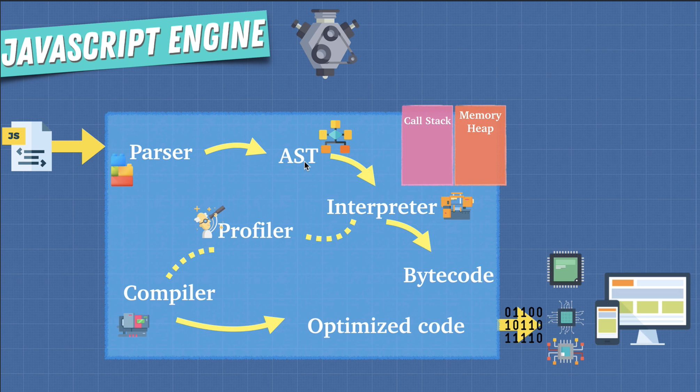

[Different Engines](https://en.wikipedia.org/wiki/List_of_ECMAScript_engines)

Engine Overview

Babel is a Javascript compiler that takes your modern JS code and returns browser compatible JS (older JS code).

Typescript is a superset of Javascript that compiles down to Javascript.

Both of these do exactly what compilers do: Take one language and convert into a different one!

JavaScript is initially interpreted and later on it is interpreted and compliled based on the engine implemenations

